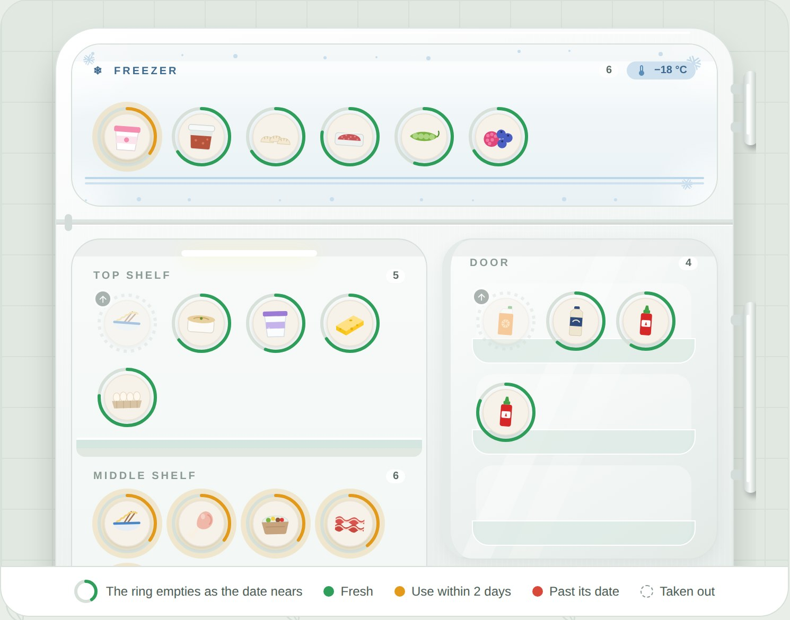
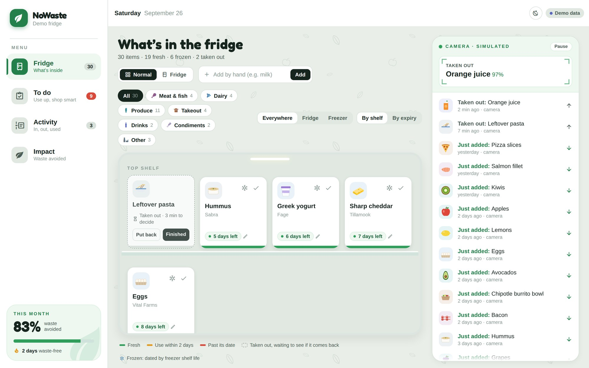
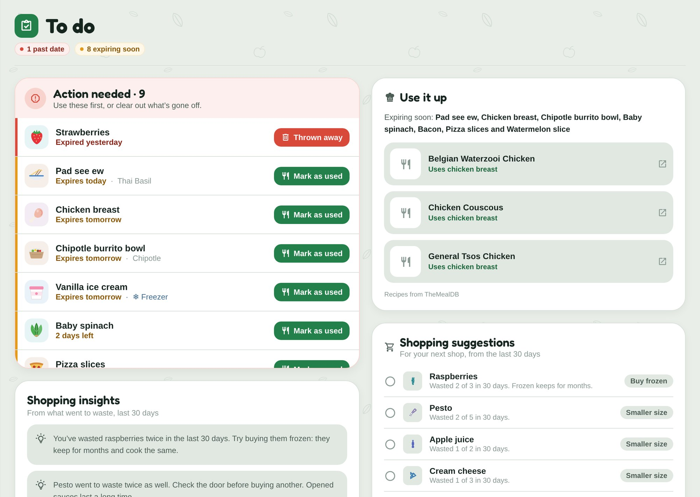
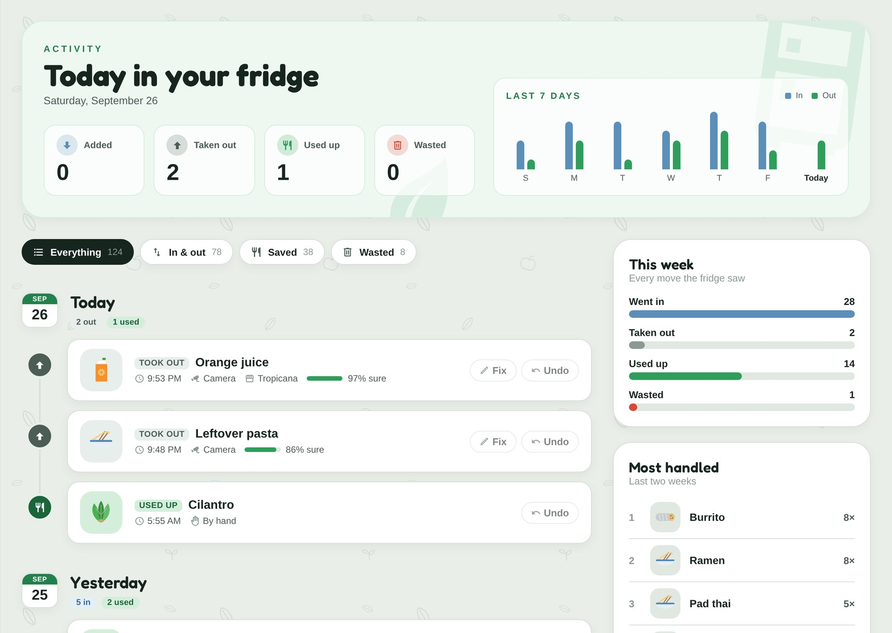
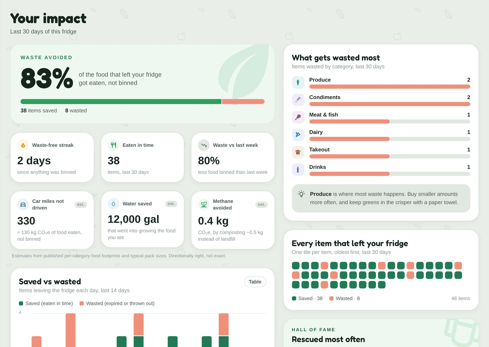
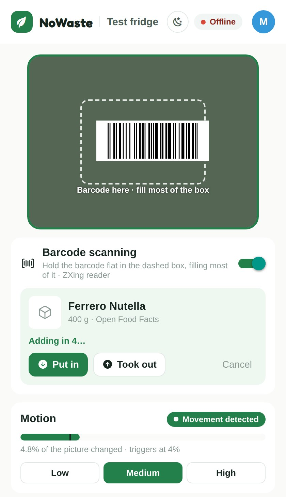
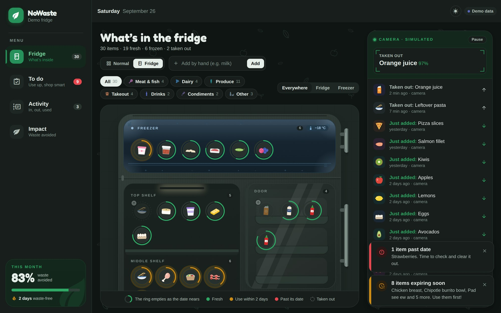
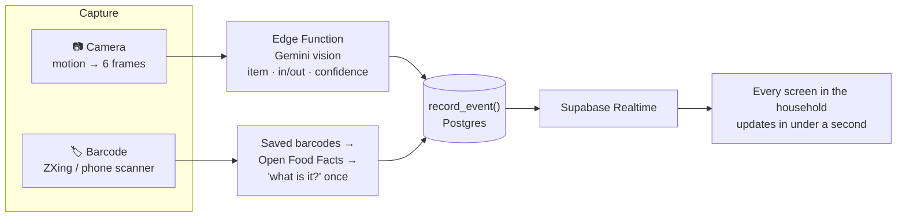

<div align="center">

# 🥬 NoWaste

**The fridge that remembers what's inside, so food gets eaten, not binned.**

A camera at the fridge sees what goes in and out. Barcodes and AI identify the food.
Everyone in the household shares one live inventory with expiry warnings.

Expo · React Native + Web · Supabase · Google Gemini · Open Food Facts



</div>

---

## The problem

The world wasted **1.05 billion tonnes** of food in 2022, and **60% of it was thrown out at home**: about 79 kg per person, every year. Food loss and waste cause **8–10% of global greenhouse gas emissions**. *(UNEP Food Waste Index Report 2024)*

Most of it isn't a bad decision. It's a forgotten one: the spinach at the back of the fridge, the leftovers nobody knew were there.

## What NoWaste does

| 👀 See it | 🧠 Name it | 👨‍👩‍👧 Share it | 🍽️ Eat it |
|---|---|---|---|
| A camera at the fridge spots food going in and out. Barcodes name packaged food exactly. | AI vision says what each item is and which way it went, with a confidence score. | One live inventory for the whole household, every item with an expiry date. | Warnings, recipes and shopping nudges before anything goes off. |

Nobody has to type anything in. The fridge keeps its own list.

## A quick tour

### Fridge: the live dashboard
Items laid out like a real fridge (shelves, crisper, door and freezer), color-coded **fresh / use within 2 days / past its date**. One tap moves something to the freezer and re-dates it; a thawing clock starts when it comes back out. Things the camera saw leave wait as dashed "taken out" cards, in case they go back in.



### To do: what needs a decision today
Everything expiring soon, recipe ideas built from those items, and shopping nudges learned from what the household actually wastes (*"You've wasted raspberries twice this month. Try buying frozen."*).



### Activity: everything the fridge has seen
A timeline by day with **Undo** and **Fix**. Correct a wrong detection once and it's remembered, so the same mistake doesn't come back.



### Impact: why it matters
The share of food eaten instead of binned, a waste-free streak, what gets wasted most, and estimates people can feel: car miles not driven, water saved, methane avoided.



### Getting food in: camera and barcodes

<table>
<tr>
<td width="38%"></td>
<td>

**Camera tab (laptop):** motion detection wakes it, 6 frames per movement go to the AI, and results show as *"Added apple"* with Fix / Undo, plus lower-confidence *"AI saw…"* hints. Barcodes read here too, with a direction guess (already in the fridge → "took out").

**Scan tab (phone):** the native scanner reads barcodes up close with a vibration and green flash. **Read date** photographs the printed best-by date and sets the item's expiry.

**In the real product,** a small camera sits inside the fridge by the door, facing out, and wakes when the door light turns on. The laptop stands in for it in the demo.

</td>
</tr>
</table>

### Also
- **Households:** create or join a fridge with a share code; everyone sees the same inventory, live.
- **Smart expiry:** shelf life by food *and* location (meat ~4 days in the fridge, ~6 months frozen), editable by hand or read off the package.
- **Alerts:** in-app toasts plus optional browser or phone notifications.
- **One codebase:** phone (Expo Go), tablet and desktop web from the same app.
- **Demo mode:** a seeded fridge and a simulated camera. No account, no setup.
- **Light and dark mode.**



## How it works



Every detection, whether from the camera, a barcode or a tap, goes through one Postgres function, `record_event()`. It updates the shared inventory and logs the event in one transaction, with row-level security so each household only sees its own fridge. Photos are sent to the AI and never stored.

## Built with

| | |
|---|---|
| **App** | [Expo](https://expo.dev) (React Native + web, one codebase), Expo Router, Tailwind via [Uniwind](https://uniwind.dev), TypeScript |
| **Backend** | [Supabase](https://supabase.com): Auth, Postgres, Realtime, Edge Functions |
| **AI** | Google Gemini for vision and text (Claude also supported) |
| **Food data** | [Open Food Facts](https://world.openfoodfacts.org) for barcodes, [TheMealDB](https://www.themealdb.com) for recipes |
| **Barcodes** | ZXing on web, expo-camera on phones |

## Try it

The fastest way is demo mode: no account and no database.

```bash
git clone https://github.com/OthmaneHarraq/NoWaste.git && cd NoWaste
npm install
cp .env.example .env        # demo mode is on by default (Windows: copy .env.example .env)
npx expo start --web
```

Or run `npx expo start` and scan the QR code with Expo Go to open it on your phone.

To run it against a real Supabase project, deploy the AI functions, or develop on it, see the **[developer guide](docs/SETUP.md)**.

## What's next

- A camera built into the fridge that wakes on the door light
- Sharper recognition: the clearest frames, at higher resolution, to a stronger vision model
- In/out zones, so the side of the frame an item leaves by decides its direction
- App-store builds and per-household AI limits
